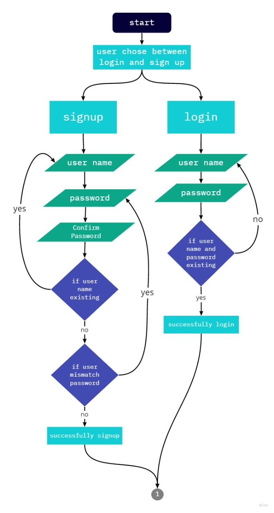
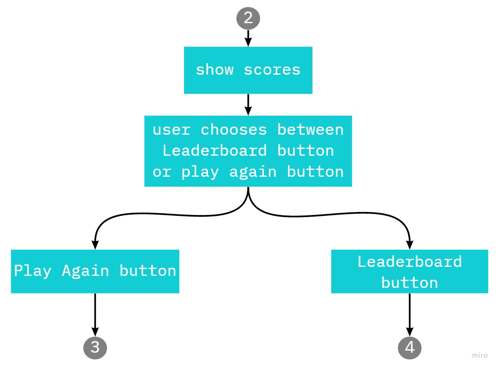
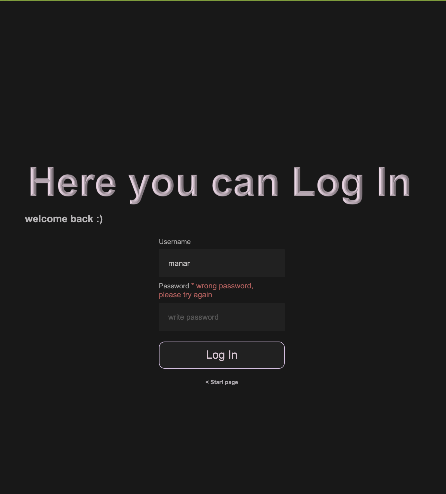
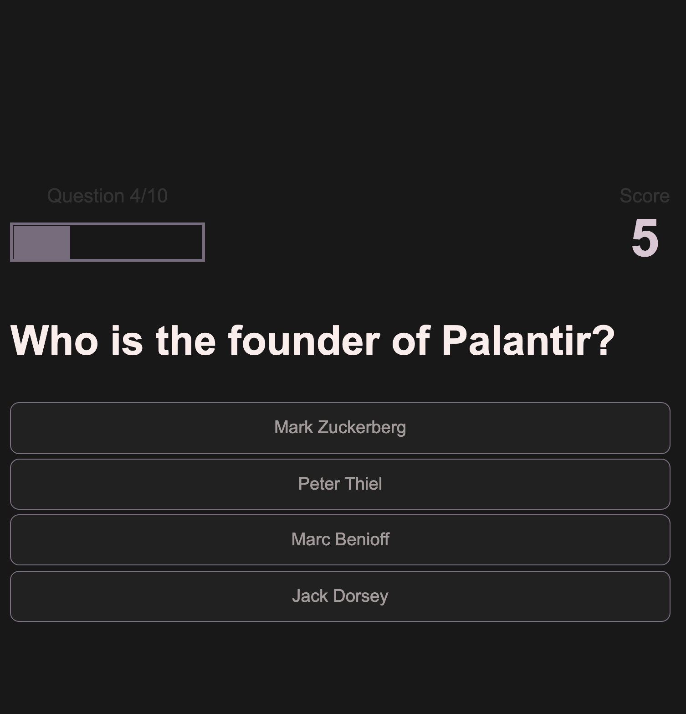
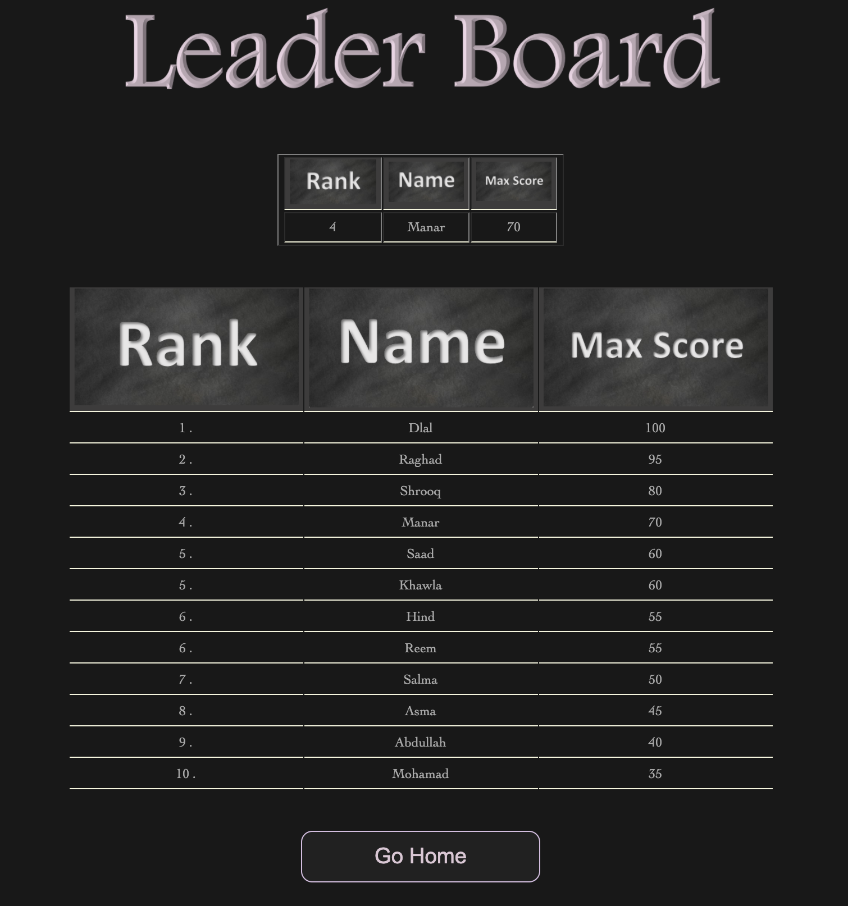

# DRSM
Quiz App - Internet Technologies[CS38] Course Project

# Quiz Time

## Overview
Quiz Time is an app that allows the user to have its own account to test their knowledge on various programming languages and technologies and have fun at the same time with a global leaderboard that allows the user to know his ranks among all the players and to see the top 10 players that have the maximum score.

### User Interaction (flow chart)

### Some screenshot of the Quizapp
Start page:

Log in page when the user enter wrong password:

Questions page:

Leader board page:

### Technologies Used In Application
>- XAMAP
>- Open Trivia database API
>- MySQL Database
>- Cookies
>- Table
>- Forms
>- Languages:
>   - HTML
>   - CSS
>   - JavaScript
>   - Php

## Demo

